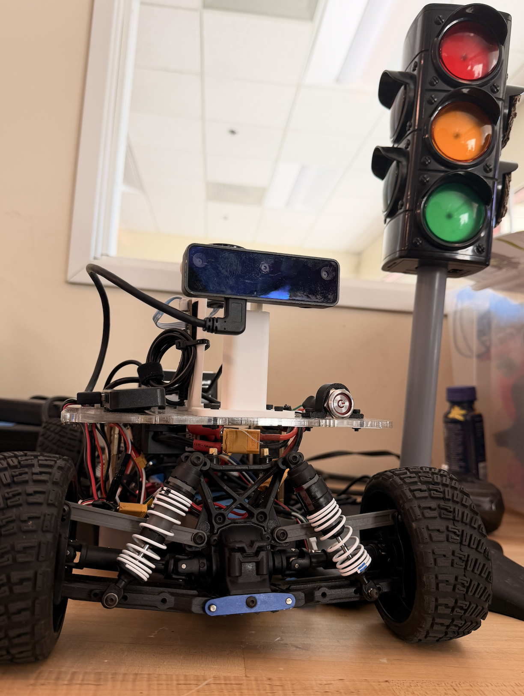
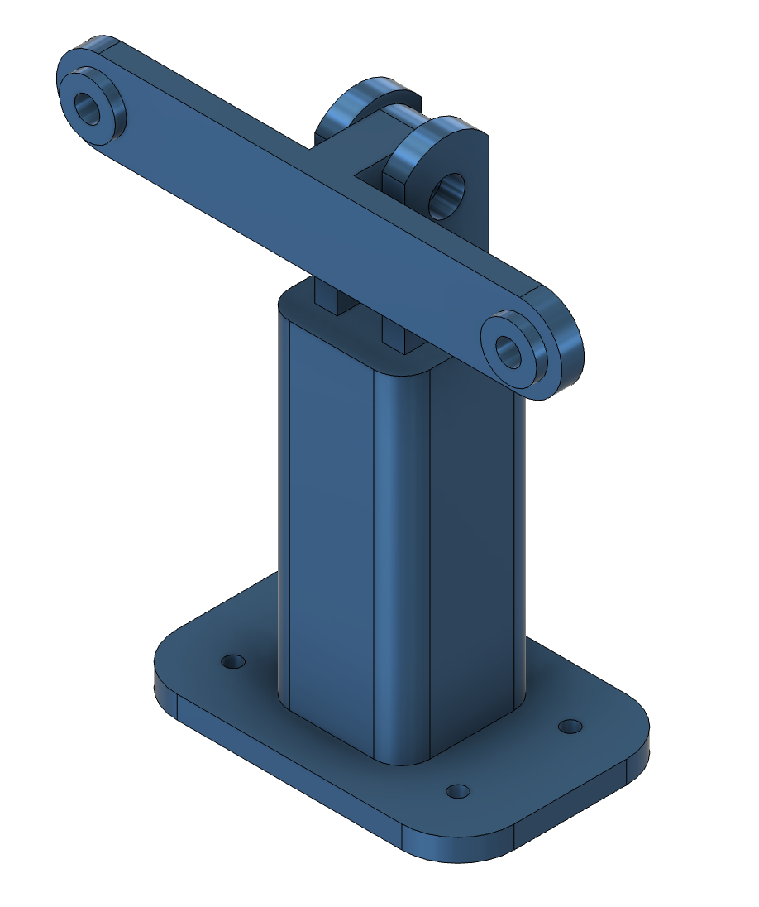
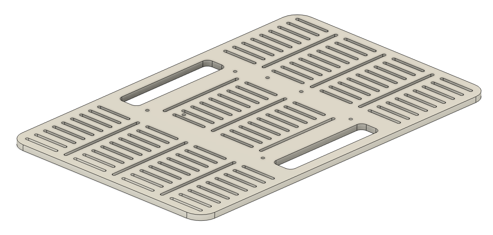
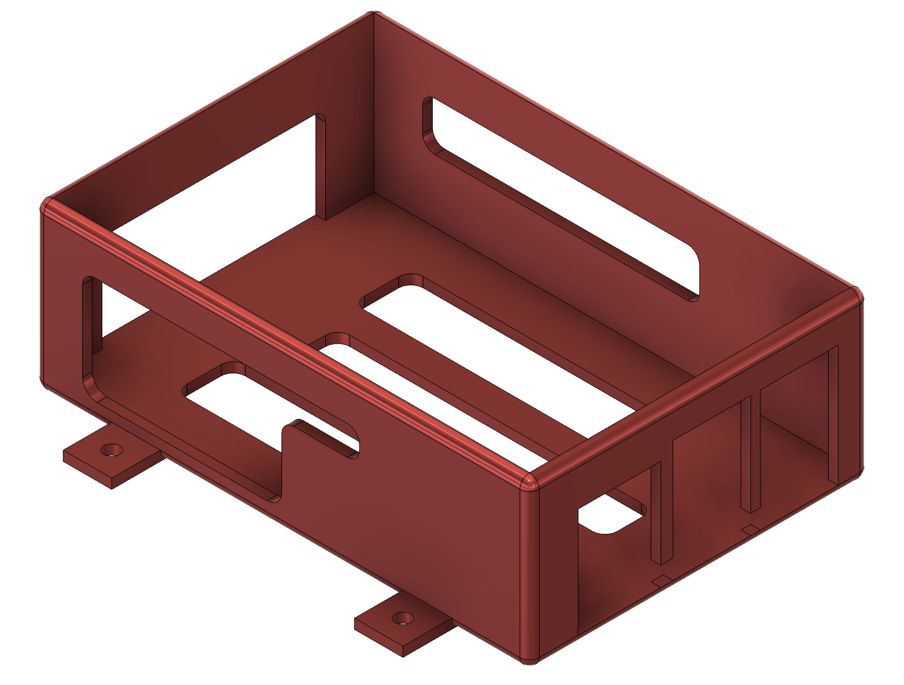
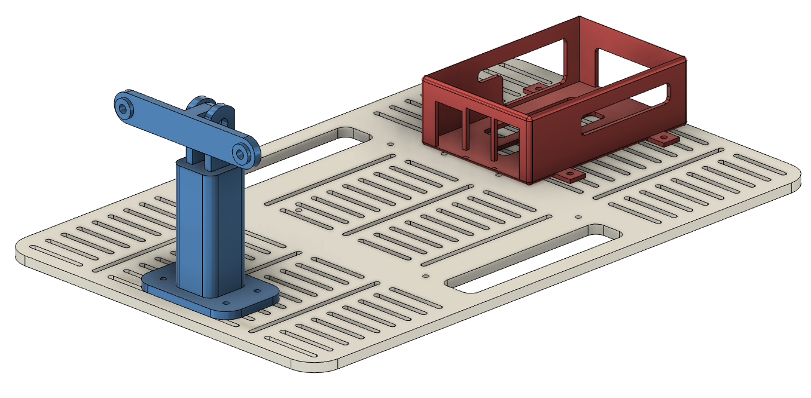
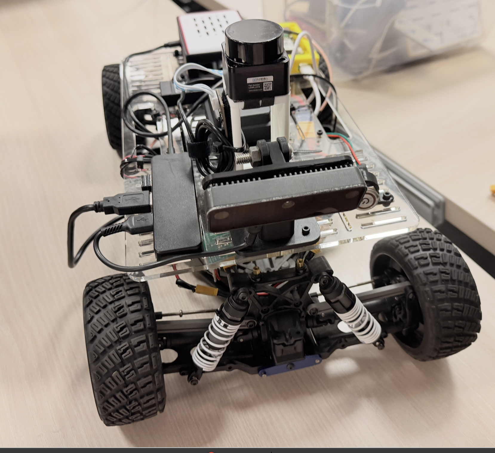
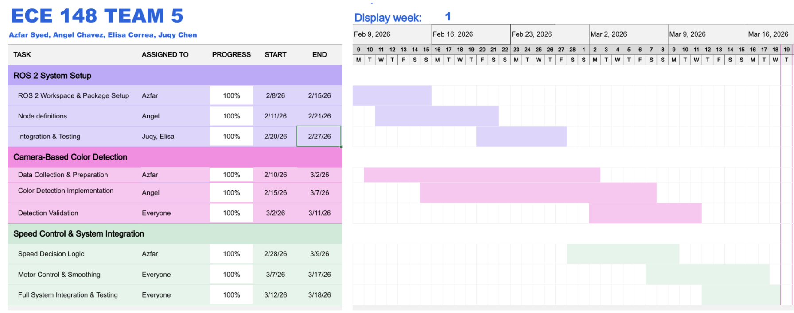

<p align="center">
  
</p>

<h1 align="center">Team 5 - Traffic Control Obstacle Avoidance Car</h1>

<p align="center">
  <b>Institution:</b> University of California, San Diego (UCSD) <br>
  <b>School:</b> Jacobs School of Engineering (JSOE) <br>
  <b>Course:</b> MAE 148 - Autonomous Vehicles <br>
  <b>Term:</b> Winter 2026 <br>
  <b>Team:</b> Team 5
</p>

<p align="center">
  <b>Intro</b><br>
  
</p>


---

## Table of Contents
- [Table of Contents](#table-of-contents)
- [Team Members](#team-members)
- [Overview](#overview)
- [Goals We Met](#goals-we-met)
- [Final Project Videos](#final-project-videos)
- [CAD Parts](#cad-parts)
- [Key Files](#key-files)
- [Key Features](#key-features)
- [Final Assembly](#final-assembly)
- [Software Design](#software-design)
- [Gantt Chart](#gantt-chart)

---

## Team Members
| Name | Major |
|-----|-----|
| Azfar Syed | Electrical & Computer Engineering |
| Angel Chavez | Electrical & Computer Engineering |
| Juqy Chen | Electrical & Computer Engineering |
| Elisa Correa | Mechanical & Aerospace Engineering |


---

## Overview

This project was developed for MAE/ECE 148: Autonomous Vehicles at UC San Diego. The goal of the project was to design and implement a camera-based traffic control system for an autonomous RC vehicle that can navigate a track while responding to traffic signals and avoiding obstacles.

The system uses an OAK-D Lite camera and ROS2-based control architecture to detect environmental cues and adjust the vehicle’s behavior in real time. Computer vision models were trained using Roboflow to recognize traffic lights (red, yellow, and green) and orange traffic cones placed along the track. These detections are used to dynamically control the vehicle’s speed and navigation.

The vehicle performs lane-following and autonomous navigation while interpreting traffic signals to determine appropriate driving actions. For example, the vehicle adjusts its speed based on traffic light states and performs obstacle avoidance maneuvers when cones are detected.

To ensure reliable performance, the system integrates PID control for steering and speed regulation, and multiple camera configurations were tested to improve robustness under different lighting conditions. The system was evaluated by running autonomous laps on the course with increasing precision and stability.

This project demonstrates the integration of robot perception, computer vision, and control systems to create a responsive autonomous driving platform capable of reacting to real-world traffic scenarios.

---

## Goals We Met

- Successfully implemented a ROS2-based autonomous driving pipeline
- Developed and deployed a Roboflow model for traffic light detection (red, yellow, green)
- Integrated perception with control to enable stop/go behavior based on traffic light state

---

## Final Project Videos


https://github.com/user-attachments/assets/07e71f53-c20c-4cf6-994f-b9095cc72826


---

## CAD Parts

<p align="center">
  <b>Camera Mount</b><br>
  
</p>

<p align="center">
  <b>Bellypan</b><br>
  
</p>

<p align="center">
  <b>Raspberry Pi Mount</b><br>
  
</p>

<p align="center">
  <b>Assembly</b><br>
  
</p>

---
## Key Files
We built upon the classes lane detection ROS2 implimentaion. Added files and changed:

Lane detection Node
- /home/projects/ros2_ws_a/src/ucsd_robocar_hub2/ucsd_robocar_lane_detection2_pkg/ucsd_robocar_lane_detection2_pkg/traffic_light_gate_node.py
- /home/projects/ros2_ws_a/src/ucsd_robocar_hub2/ucsd_robocar_lane_detection2_pkg/ucsd_robocar_lane_detection2_pkg/lane_guidance_node.py
- /home/projects/ros2_ws_a/src/ucsd_robocar_hub2/ucsd_robocar_lane_detection2_pkg/ucsd_robocar_lane_detection2_pkg/lane_guidance_node.py
- /home/projects/ros2_ws_a/src/ucsd_robocar_hub2/ucsd_robocar_lane_detection2_pkg/ucsd_robocar_lane_detection2_pkg/cone_depth_detector_node.py
- /home/projects/ros2_ws_a/src/ucsd_robocar_hub2/ucsd_robocar_lane_detection2_pkg/ucsd_robocar_lane_detection2_pkg/calibration_node.py
- /home/projects/ros2_ws_a/src/ucsd_robocar_hub2/ucsd_robocar_lane_detection2_pkg/config/ros_racer_calibration.yaml
- /home/projects/ros2_ws_a/src/ucsd_robocar_hub2/ucsd_robocar_lane_detection2_pkg/setup.py

sensor2 node
- /home/projects/ros2_ws_a/src/ucsd_robocar_hub2/ucsd_robocar_sensor2_pkg/ucsd_robocar_sensor2_pkg/oakd_shared_node.py
- /home/projects/ros2_ws_a/src/ucsd_robocar_hub2/ucsd_robocar_sensor2_pkg/launch/camera_oakd.launch.py


## Key Features

**Traffic Light Detection**  
Detects and classifies **red, yellow, and green traffic lights** using a computer vision model trained on Roboflow. The vehicle adjusts its speed and behavior based on the detected signal state.

**Cone Detection and Obstacle Avoidance**  
Identifies **orange traffic cones** placed on the track and performs lane-switching maneuvers to safely avoid obstacles while continuing along the course.

**Camera-Based Perception**  
Uses an **OAK-D Lite camera** with DepthAI to capture real-time visual data and run object detection models for traffic lights and cones.

**ROS2 System Architecture**  
Implements a modular **ROS2 framework** where perception, control, and decision-making nodes communicate using publishers and subscribers.

**Autonomous Navigation**  
The RC vehicle autonomously drives laps around the track while maintaining lane alignment and responding to detected traffic signals and obstacles.

**Adaptive PID Control**  
Uses **PID-based steering and speed control**, with multiple parameter configurations tested to maintain stable driving performance under different lighting conditions.


## Final Assembly

<p align="center">
  <b>Final Assembly</b><br>
  
</p>
The final system consists of an RC car platform integrated with multiple sensing, compute, and power components to enable autonomous behavior. The primary perception sensor is an onboard camera used for traffic light and cone detection. All processing is handled on a Raspberry Pi, which runs the ROS2 stack and local inference server. The electronics, including the Raspberry Pi, battery, and USB hub, are housed in a custom 3D-printed enclosure designed for stability and compact integration. This assembly allows the vehicle to operate untethered while maintaining real-time perception and control on-track.

---

## Software Design 
First, we created a new Docker container by following Roboflow’s installation instructions: 
**pip install inference-cli inference server start**
This installs Roboflow’s Inference CLI tool, which sets up and manages a local inference server on the Raspberry Pi. The server loads our trained model and waits for images sent from our code. Once it receives an image, it returns predictions through the local server at: 
**http://localhost:9001**
, such as the detected traffic light, class label, confidence score, and bounding box. This inference server runs separately from the ROS 2 environment. 
We built on top of the ROS 2 package provided in class, which already performed lane following. We then added a new node that sends the camera feed to http://localhost:9001, where our Roboflow model is running, and receives the prediction results back into the ROS 2 environment. Using those results, we modified the car’s behavior based on the detected object. If a green light is detected, the car continues moving. If a red light is detected, the car stops. If a cone is detected, we use the OAK-D Lite depth function to determine how far away the cone is. If the cone is within 1.8 meters, the car runs a separate script to avoid it. These scripts temporarily override the normal lane-following behavior. Once the task is complete, control returns to the lane-guidance system so the car can continue driving smoothly


## Software Design

First, we created a new Docker container by following Roboflow’s installation instructions:

```bash
pip install inference-cli
inference server start
```

This installs Roboflow’s Inference CLI tool, which sets up and manages a local inference server on the Raspberry Pi. The server loads our trained model and waits for images sent from our code. Once it receives an image, it returns predictions through the local server at http://localhost:9001, such as the detected traffic light, class label, confidence score, and bounding box.

This inference server runs separately from the ROS 2 environment. We built on top of the ROS 2 package provided in class, which already performed lane following. We then added a new node that sends the camera feed to http://localhost:9001, where our Roboflow model is running, and receives the prediction results back into the ROS 2 environment.

Using those results, we modified the car’s behavior based on the detected object. If a green light is detected, the car continues moving. If a red light is detected, the car stops. If a cone is detected, we use the OAK-D Lite depth function to determine how far away the cone is. If the cone is within 1.8 meters, the car runs a separate script to avoid it.

These scripts temporarily override the normal lane-following behavior. Once the task is complete, control returns to the lane-guidance system so the car can continue driving smoothly.

---

## Gantt Chart

<p align="center">
  <b>Initial Gantt Chart</b><br>
  
</p>

<p align="center">
  <b>Final Gantt Chart</b><br>
  
</p>

Over the course of the project, our Gantt chart evolved significantly as we adapted to practical challenges and system constraints. Initially, we planned to rely heavily on LiDAR and GPS for localization and navigation; however, we pivoted to a camera-based approach due to better performance and integration with our perception pipeline . We also transitioned fully to ROS2 to take advantage of its modular node-based architecture and communication system. Tasks were restructured to prioritize perception (traffic light and cone detection), followed by integration with control logic. This shift highlighted the importance of flexibility in project planning, as real-world testing required us to continuously adjust priorities based on what worked reliably on the track.


---

**Last Updated:** March 13, 2026  
**Presentation Date:** [Insert date]
